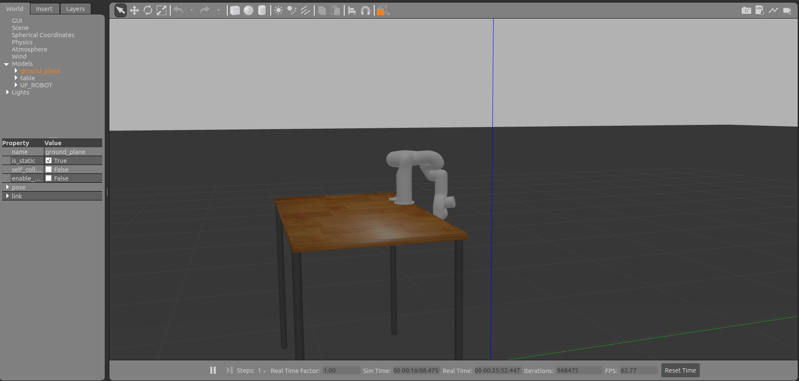

xArm6, ROS 2, Gazebo, RViz, ROS Control, Cinemática inversa
Denavit-Hartenberg, Control de trayectorias, URDF

Introducción
============

En este trabajo se llevó a cabo la simulación y control del brazo
robótico xArm6 utilizando ROS 2. Se trabajó principalmente con los
entornos de Gazebo y RViz para visualizar la configuración del robot y
validar su funcionamiento. La simulación incluyó la activación de
controladores, la ejecución de trayectorias y la representación del
entorno con una mesa como obstáculo.

Como parte de la práctica, se configuraron los controladores necesarios
mediante comandos de ROS 2 Control y se utilizó un nodo en Python para
enviar una trayectoria específica que simula un movimiento de flexión
del brazo. Esta trayectoria fue ejecutada correctamente en el simulador
Gazebo, permitiendo observar la respuesta del robot ante comandos
personalizados. Además, se comprobó la comunicación entre los distintos
nodos y tópicos del sistema, asegurando que el robot respondiera
adecuadamente a los mensajes de control.

Análisis Cinemático: Tabla de Denavit-Hartenberg
================================================

Con el objetivo de analizar el comportamiento cinemático del brazo
robótico *xArm6*, se ha utilizado el método de Denavit-Hartenberg (DH)
para describir su cadena cinemática. Este método permite expresar cada
transformación entre eslabones consecutivos mediante cuatro parámetros:
el ángulo articular $\theta_i$, la distancia $d_i$, la longitud del
eslabón $a_i$, y el ángulo de torsión $\alpha_i$.

La identificación de los parámetros DH se realizó a partir del modelo
URDF del robot contenido en el paquete `xarm_description`, en
combinación con la documentación técnica proporcionada por UFactory. Se
seleccionaron como marcos de referencia aquellos que cumplen con las
convenciones clásicas de DH, ubicando el eje $z_i$ como el eje de giro
de cada articulación y siguiendo la disposición mecánica del robot. La
tabla resultante se presenta a continuación:

**Tabla 1. Parámetros DH del xArm6**

| Articulación `i` | `θ_i` (rad) | `d_i` (m) | `a_i` (m) | `α_i` (rad) |
|------------------|-------------|-----------|-----------|-------------|
| 1                | `θ_1`       | 0.267     | 0         | `-π/2`      |
| 2                | `θ_2`       | 0         | 0.293     | 0           |
| 3                | `θ_3`       | 0         | 0.300     | 0           |
| 4                | `θ_4`       | 0.302     | 0         | `-π/2`      |
| 5                | `θ_5`       | 0         | 0         | `π/2`       |
| 6                | `θ_6`       | 0.072     | 0         | 0           |

---

[\[tab:dh\_xarm6\]]{#tab:dh_xarm6 label="tab:dh_xarm6"}

Los parámetros se definieron de la siguiente forma:

-   $\theta_i$: ángulo articular variable de cada articulación
    rotacional.

-   $d_i$: desplazamiento a lo largo del eje $z_{i-1}$.

-   $a_i$: longitud del eslabón, distancia entre ejes $z_{i-1}$ y $z_i$
    medida sobre $x_{i-1}$.

-   $\alpha_i$: ángulo entre ejes $z_{i-1}$ y $z_i$ alrededor de
    $x_{i-1}$.

.

### Formación de parámetros y de la cadena cinemática {#formación-de-parámetros-y-de-la-cadena-cinemática .unnumbered}

Los parámetros de la tabla DH fueron obtenidos a partir del modelo URDF
oficial del xArm6, el cual describe las dimensiones geométricas y la
disposición relativa de cada eslabón. Para cada articulación, se
identificaron los ejes de rotación (ejes $z$) y las distancias entre
ejes consecutivos, lo cual permitió asignar los valores de $d_i$, $a_i$
y $\alpha_i$ siguiendo las convenciones estándar de Denavit-Hartenberg.

El ángulo $\theta_i$ se mantiene como variable, ya que cada articulación
es de tipo rotacional. La secuencia de marcos de referencia fue
construida asegurando que el eje $z_i$ coincida con el eje de rotación
de la $i$-ésima articulación, y el eje $x_i$ apunte desde $z_{i-1}$
hacia $z_i$ de forma perpendicular. De esta manera, se forma una cadena
cinemática en la que cada transformación homogénea representa el cambio
de coordenadas entre eslabones consecutivos. Esta descripción fue
validada comparando la posición del efector final resultante con la
generada por el modelo URDF.

Visualización de la Posición del Efector Final en RViz
======================================================

Para validar la cadena cinemática modelada mediante los parámetros de
Denavit-Hartenberg, se eligió una configuración articular específica del
robot *xArm6* y se calculó manualmente la posición del efector final
utilizando transformaciones homogéneas. Posteriormente, esta posición
fue representada gráficamente en RViz mediante un mensaje de tipo
`visualization_msgs::Marker`.

La configuración articular utilizada fue:
$$\theta = [0^\circ,\ 0^\circ,\ 90^\circ,\ 0^\circ,\ 0^\circ,\ 0^\circ]$$

A partir de la tabla DH y esta configuración, se construyeron las
matrices homogéneas $A_i$ para cada articulación: $$A_i = 
\begin{bmatrix}
\cos\theta_i & -\sin\theta_i\cos\alpha_i & \sin\theta_i\sin\alpha_i & a_i\cos\theta_i \\
\sin\theta_i & \cos\theta_i\cos\alpha_i & -\cos\theta_i\sin\alpha_i & a_i\sin\theta_i \\
0 & \sin\alpha_i & \cos\alpha_i & d_i \\
0 & 0 & 0 & 1
\end{bmatrix}$$

La transformación total se obtuvo mediante la multiplicación sucesiva:
$$T_0^6 = A_1 A_2 A_3 A_4 A_5 A_6$$

El vector de posición del efector final se extrae de la última columna
de la matriz $T_0^6$.

Visualización de la posición del efector final en RViz
======================================================

Para verificar la posición del efector final, se utilizó el paquete
`robot_state_publisher` junto con `joint_state_publisher_gui`, lo cual
permitió manipular la configuración articular del robot de forma
gráfica.

A partir de dicha configuración, se publicó un marcador tipo esfera
mediante un nodo en Python que consulta la transformada
`link_base \rightarrow link_eef` usando `tf2`. La posición del marcador
coincide con la posición calculada del efector final, validando así que
la cadena cinemática esté correctamente descrita en el modelo URDF.


### Verificación en RViz {#verificación-en-rviz .unnumbered}

Para la visualización se lanzaron los nodos `robot_state_publisher` y
`joint_state_publisher_gui`, permitiendo modificar los ángulos
articulares en tiempo real. Se comprobó que la posición del marcador
coincidía visualmente con el `tf` del efector final publicado por el
URDF, verificando así la consistencia entre el modelo analítico (DH) y
el modelo descriptivo (URDF).

Simulación en Gazebo con controladores
======================================

Para validar el comportamiento del modelo cinemático en un entorno
físico simulado, se utilizó el simulador Gazebo junto con el paquete
`xarm_gazebo`. El robot se posicionó sobre una mesa en un entorno
controlado, lo cual permite recrear tareas colaborativas en un espacio
limitado.

El modelo fue cargado mediante el siguiente comando:

``

A continuación, se habilitó la interfaz de control usando los siguientes
comandos desde terminal:

-   Activación del `joint_state_broadcaster`:
    ```bash
    ros2 control load_controller --set-state active joint_state_broadcaster
    ```

-   Activación del controlador principal de trayectoria:
     ```bash
    ros2 control load_controller --set-state active xarm6_traj_controller
    ```

Una vez cargados los controladores, se verificó la disponibilidad del
tópico de acción:

    ros2 topic list | grep trajectory

Esto permitió enviar comandos de movimiento al robot simulando el efecto
de una flexión o postura inicial. La
Figura [3](#fig:gazebo_home){reference-type="ref"
reference="fig:gazebo_home"} muestra la posición inicial del brazo sobre
la mesa dentro del entorno de Gazebo.


Los movimientos se realizaron enviando metas articuladas mediante un
script en Python que utiliza la acción `FollowJointTrajectory`. El
comportamiento fue coherente con las limitaciones cinemáticas del brazo
y la configuración del modelo URDF.

Generación heurística de una sentadilla
=======================================

Para emular una sentadilla con el brazo robótico, se diseñó una
secuencia de configuraciones articulares basadas en un análisis
heurístico. Este tipo de movimiento fue seleccionado por su naturaleza
compacta, repetitiva y biomecánicamente coherente, lo cual permite
validar tanto la precisión como la continuidad de la trayectoria
generada.

Las configuraciones articulares fueron ajustadas mediante prueba y
error, observando visualmente la evolución del efector final en el
entorno simulado de Gazebo. Se buscó que el efector descendiera de forma
controlada y simétrica, evitando colisiones con la mesa.

### Implementación de la secuencia {#implementación-de-la-secuencia .unnumbered}

La secuencia fue implementada con un script en Python que publica
trayectorias articuladas al controlador `xarm6_traj_controller`. Se
definieron al menos tres poses consecutivas que simulan el descenso y
ascenso del efector final, manteniendo la base fija:

1.  **Postura inicial:** configuración articulada equivalente a la
    posición \"home\".

2.  **Descenso parcial:** los ángulos del hombro y codo se ajustan para
    reducir la altura del efector.

3.  **Descenso completo:** se maximiza el efecto de la articulación 5
    para llevar el efector al punto más bajo.

4.  **Regreso a postura inicial.**

### Verificación visual {#verificación-visual .unnumbered}

La Figura [4](#fig:sentadilla){reference-type="ref"
reference="fig:sentadilla"} muestra la postura intermedia durante la
ejecución de la sentadilla. Esta fue capturada en Gazebo y confirma que
el efector sigue una trayectoria vertical descendente. Se verificó
además que el controlador interpolara correctamente entre las poses sin
generar oscilaciones ni comportamientos inesperados.




[  ](https://youtu.be/BZCWY3WiM1Q)

Conclusión
==========

En este trabajo se integraron múltiples herramientas del ecosistema
ROS 2 para modelar, visualizar y controlar un brazo robótico en entornos
simulados con RViz y Gazebo. Se construyó la tabla de Denavit-Hartenberg
para una sección del robot, permitiendo comprender su cadena cinemática.
Posteriormente, se validó visualmente la posición del efector final
mediante la publicación de un marcador esférico en RViz, comparando su
ubicación con la transformada TF publicada por el modelo.

Además, se logró simular el robot en Gazebo con controladores
configurados, empleando el stack de `ros2_control` para permitir la
ejecución de comandos articulados. Finalmente, se diseñó una secuencia
de movimientos que emulan una sentadilla, demostrando la capacidad del
robot para ejecutar trayectorias complejas y articuladas con
estabilidad.

Este proyecto sentó las bases para futuras tareas de control más
avanzadas como seguimiento de trayectorias con realimentación sensorial
o aprendizaje de movimientos por demostración.

00 UFACTORY, "xArm6 Technical Manual," \[Online\]. Available:
<https://www.ufactory.cc/download/xArm6>. ROS 2 Control, "ros2\_control
Documentation," \[Online\]. Available: <https://control.ros.org/>. Open
Source Robotics Foundation, "gazebo\_ros\_pkgs," \[Online\]. Available:
<http://gazebosim.org/tutorials?tut=ros_overview>. ROS 2 TF2 Library,
"tf2 Tutorials," \[Online\]. Available:
<https://docs.ros.org/en/rolling/Tutorials/Intermediate/Tf2/Tf2-Main.html>.
J. Denavit and R.S. Hartenberg, "A kinematic notation for lower-pair
mechanisms based on matrices," ASME Journal of Applied Mechanics, vol.
22, pp. 215--221, 1955. ROS, "RViz - ROS Wiki," \[Online\]. Available:
<http://wiki.ros.org/rviz>.
