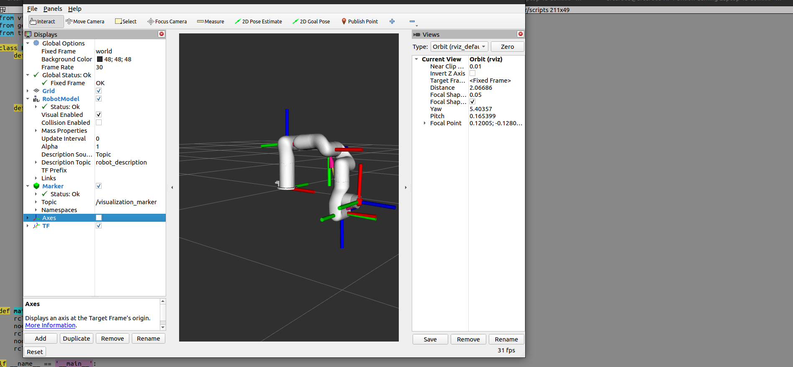
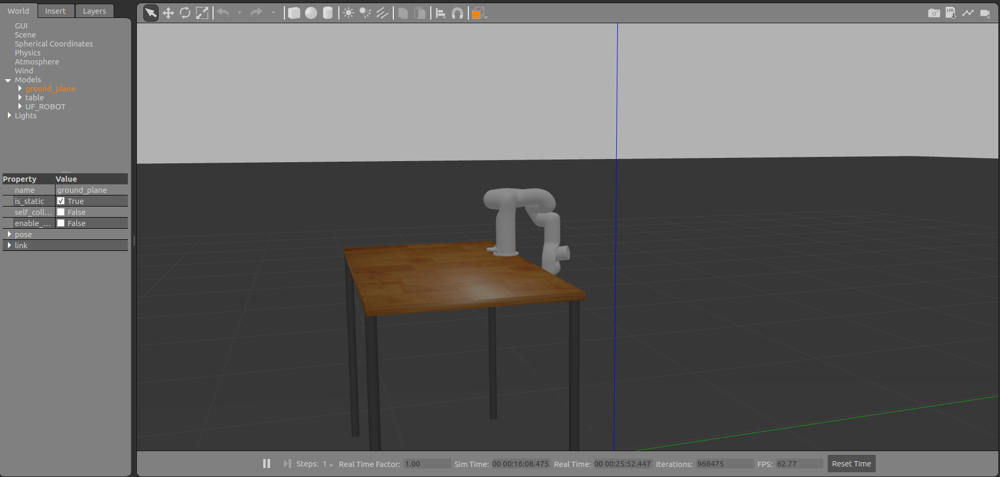

# Simulación y Análisis del Robot xArm6 en ROS 2 y Gazebo

**Clarissa Gardea Coronado**, Tecnológico de Monterrey, Zapopan, México — a01569420@tec.mx  
**Arturo Azael Godínez Rodríguez**, Tecnológico de Monterrey, Zapopan, México — a01641179@tec.mx  
**David Gómez Carrillo**, Tecnológico de Monterrey, Zapopan, México — a01642824@tec.mx  
**Andrés Lepe Alvarado**, Tecnológico de Monterrey, Zapopan, México — a01643265@tec.mx  
**Christian Omar Payán Torróntegui**, Tecnológico de Monterrey, Zapopan, México — a01742658@tec.mx  

---

## Resumen

Este trabajo presenta la simulación, modelado y control del brazo robótico *xArm6* utilizando el entorno robótico ROS 2. Se realizó un análisis cinemático mediante el método de Denavit-Hartenberg (DH) para describir la cadena cinemática del manipulador, cuyos resultados fueron validados visualmente en RViz mediante la publicación de un marcador en la posición del efector final. Además, se implementó la simulación del robot en Gazebo con el entorno `xarm_gazebo`, configurando controladores con `ros2_control` para ejecutar trayectorias articuladas. Finalmente, se diseñó e implementó una secuencia de movimientos tipo sentadilla como demostración de control personalizado, validando así la coherencia entre el modelo analítico, el descriptivo (URDF) y el comportamiento simulado.

---

**Palabras clave:** xArm6, ROS 2, Gazebo, RViz, ROS Control, Cinemática inversa Denavit-Hartenberg, Control de trayectorias, URDF

---

## Introducción

En este trabajo se llevó a cabo la simulación y control del brazo robótico xArm6 utilizando ROS 2. Se trabajó principalmente con los entornos de Gazebo y RViz para visualizar la configuración del robot y validar su funcionamiento. La simulación incluyó la activación de controladores, la ejecución de trayectorias y la representación del entorno con una mesa como obstáculo.

Como parte de la práctica, se configuraron los controladores necesarios mediante comandos de ROS 2 Control y se utilizó un nodo en Python para enviar una trayectoria específica que simula un movimiento de flexión del brazo.

---

## Análisis Cinemático: Tabla de Denavit-Hartenberg

El análisis cinemático se basó en el método de Denavit-Hartenberg, que describe las transformaciones entre eslabones mediante los parámetros:

- \( \theta_i \): ángulo articular  
- \( d_i \): desplazamiento sobre \( z_{i-1} \)  
- \( a_i \): longitud sobre \( x_{i-1} \)  
- \( \alpha_i \): ángulo entre \( z_{i-1} \) y \( z_i \)

### Tabla de parámetros DH:

| Articulación \( i \) | \( \theta_i \) (rad) | \( d_i \) (m) | \( a_i \) (m) | \( \alpha_i \) (rad) |
|----------------------|----------------------|---------------|---------------|-----------------------|
| 1                    | \( \theta_1 \)       | 0.267         | 0             | \( -\frac{\pi}{2} \)  |
| 2                    | \( \theta_2 \)       | 0             | 0.293         | \( 0 \)               |
| 3                    | \( \theta_3 \)       | 0             | 0.300         | \( 0 \)               |
| 4                    | \( \theta_4 \)       | 0.302         | 0             | \( -\frac{\pi}{2} \)  |
| 5                    | \( \theta_5 \)       | 0             | 0             | \( \frac{\pi}{2} \)   |
| 6                    | \( \theta_6 \)       | 0.072         | 0             | \( 0 \)               |

---

## Visualización de la Posición del Efector Final en RViz

Se eligió la configuración:

\[
\theta = [0^\circ,\ 0^\circ,\ 90^\circ,\ 0^\circ,\ 0^\circ,\ 0^\circ]
\]

Se calcularon las matrices homogéneas \( A_i \) y su producto total:

\[
A_i =
\begin{bmatrix}
\cos\theta_i & -\sin\theta_i\cos\alpha_i & \sin\theta_i\sin\alpha_i & a_i\cos\theta_i \\
\sin\theta_i & \cos\theta_i\cos\alpha_i & -\cos\theta_i\sin\alpha_i & a_i\sin\theta_i \\
0 & \sin\alpha_i & \cos\alpha_i & d_i \\
0 & 0 & 0 & 1
\end{bmatrix}
\]

\[
T_0^6 = A_1 A_2 A_3 A_4 A_5 A_6
\]



---

## Simulación en Gazebo con controladores

```bash
ros2 launch xarm_gazebo xarm6_beside_table_gazebo.launch.py
```

```bash
ros2 control load_controller --set-state active joint_state_broadcaster
ros2 control load_controller --set-state active xarm6_traj_controller
```

```bash
ros2 topic list | grep trajectory
```


---

## Generación heurística de una sentadilla

Secuencia:

1. Postura inicial  
2. Descenso parcial  
3. Descenso completo  
4. Regreso a home



[](https://youtu.be/BZCWY3WiM1Q)

---

## Conclusión

Se integraron herramientas de ROS 2 para simular y controlar el robot xArm6. Se validó la tabla DH mediante RViz y se logró ejecutar trayectorias en Gazebo con controladores activos. La sentadilla simulada demostró el control articulado y la coherencia entre el modelo analítico y la simulación.

---

## Referencias

1. [xArm6 Technical Manual](https://www.ufactory.cc/download/xArm6)  
2. [ros2_control Documentation](https://control.ros.org/)  
3. [gazebo_ros_pkgs](http://gazebosim.org/tutorials?tut=ros_overview)  
4. [tf2 Tutorials](https://docs.ros.org/en/rolling/Tutorials/Intermediate/Tf2/Tf2-Main.html)  
5. Denavit y Hartenberg, ASME Journal of Applied Mechanics, 1955  
6. [RViz - ROS Wiki](http://wiki.ros.org/rviz)
